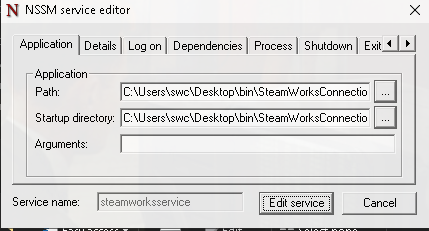

# SteamworksConnection (SWC) Virtual Machine

- SWC-VM is a virtual machine connected to the production K8s cluster via a VPN-Peering taking place in Azure, this allows for the consumption of messages from the internal Rabbit cluster.
- SWC-VM is responsible for the translation of CSGO SharingCodes to Demo download links.

## Requirements
- Windows10
- Steam
- [SteamworksConnection](https://gitlab.com/mentorgg/csgo/SteamworksConnection)
- [SteamworksService](https://gitlab.com/mentorgg/csgo/steamworksservice)

## Maintenance

### NSSM



To ensure all required software keeps running after crashes we are using [NSSM](https://nssm.cc/).

```shell
$ nssm [start|stop|restart] [steam|steamworksservice|rabbitlistener]
```

### Connecting to the VM

##### Windows Client
- Remote Desktop (Built in application)
##### Linux Client
- [Remmina](https://remmina.org/how-to-install-remmina/)

Using one of the above applications, connect to the VM with the credentials below:
```txt
Host: 23.97.155.28
User: swc
Password: 6ziTn9JhQ8TeYPTj
```


### Upgrading an application

To upgrade either SteamworksConnection (C++) or SteamworksService (C#):

- 1. Connect to the VM via Remote Desktop Protocol (RDP), Sharing a folder on your local machine with the connection.
- 2. Place the new application under it's respective folder in `C:\Users\swc\Desktop\bin\`.
- 3. If the filename or path has changed, edit the `NSSM` configuration.
    ```shell
    $ nssm edit [steamworksservice|rabbitlistener]
    ```
    Update the **Path** and **Startup Directory** to the new filepath.


- 4. Restart the `NSSM` service.
    ```shell
    $ nssm restart [steamworksservice|rabbitlistener]
    ```


